# BEDA Inbound Inquiry Router & Orchestrator

This repository is a dependency-light local reference implementation of the decision and approval boundary for an inbound inquiry router. It runs without external services. Infrastructure integrations are design boundaries, not implemented features.

---

## 1. Local Implementation Scope

The local implementation provides a self-contained vertical slice focusing on data validation, deterministic routing policy, cryptographic human approval enforcement, and verifiable audit logging:

- **Strict domain validation (`models.py`):** Pydantic v2 models with `extra="forbid"`, frozen state mutation guards, timezone-aware datetime validation, and bounds on all fields.
- **Deterministic policy engine (`policy.py`):** Pure function evaluating untrusted extraction results against a 7-rule precedence table with stable reason codes. Lead tier is deterministically recomputed from normalized budget.
- **Cryptographic approval gate (`approval.py`):** HMAC-SHA256 tokens binding the approved draft, normalized recipient, decision ID, and single-use nonce. Enforces strict approval eligibility and internal payload hash computation.
- **Append-only audit sink (`audit.py`):** Canonical JSON Lines logger with SHA-256 hash chaining and chain verification. Truncates sensitive details and excludes raw inquiry bodies.
- **Safe mock dispatcher (`dispatch.py`):** Accepts only verified `ApprovalCommand` objects. Rejects direct model outputs, expired tokens, and replayed nonces.

---

## 2. Non-Implemented Design Boundaries

To maintain testability and eliminate external network dependencies, the following components are modeled as design boundaries:

| Component | Nature of Boundary | Target Implementation Architecture |
|---|---|---|
| **HTTP Gateway** | Design boundary | FastAPI edge endpoint with HMAC webhook verification and IP rate limiting. |
| **Task Broker** | Design boundary | Celery workers backed by Redis for asynchronous queueing and dead-letter buffering. |
| **Relational Storage** | Design boundary | PostgreSQL 16 for CRM state, accounts, and transactional inquiry tracking. |
| **Vector Search** | Design boundary | `pgvector` HNSW indexing for semantic duplicate detection and FAQ matching. |
| **LLM Inference** | Design boundary | Claude / GPT API calls with JSON Schema enforcement and schema retry logic. |
| **PII Redactor** | Design boundary | Presidio NLP analyzer for masking named entities before external inference calls. |
| **Approval Interface** | Design boundary | Interactive Slack Block Kit action endpoints delivering signed callback payloads. |
| **Outbound SMTP/API** | Design boundary | Rate-limited SendGrid / SES client using provider-side idempotency keys. |
| **Distributed Replay** | Design boundary | Redis atomic `SET key value NX EX <ttl>` for cluster-wide nonce deduplication. |

See [`docs/implementation-status.md`](docs/implementation-status.md) for full traceability.

---

## 3. Quickstart

### Linux / macOS

```bash
# 1. Create and activate virtual environment
python3 -m venv .venv
source .venv/bin/activate

# 2. Install package in editable mode with development dependencies
pip install -e '.[dev]'

# 3. Generate a 32-byte secret key and export to environment
export BEDA_APPROVAL_SECRET="$(python3 -c 'import secrets; print(secrets.token_hex(32))')"

# 4. Run test suite
pytest -q

# 5. Execute local demo
python3 -m beda_orchestrator.demo
```

### Windows (PowerShell)

```powershell
# 1. Create and activate virtual environment
python -m venv .venv
.venv\Scripts\Activate.ps1

# 2. Install package in editable mode with development dependencies
pip install -e '.[dev]'

# 3. Set approval secret in current shell session
$env:BEDA_APPROVAL_SECRET = (python -c "import secrets; print(secrets.token_hex(32))")

# 4. Run test suite
pytest -q

# 5. Execute local demo
python -m beda_orchestrator.demo
```

---

## 4. Demo Scenarios & Expected Outcomes

Running `python -m beda_orchestrator.demo` executes five sequential scenarios against the reference implementation:

1. **Standard Support Inquiry:** Valid inquiry routed to `queue_for_hitl_draft_review` with reason code `standard_hitl_review`. Held for review; draft is not dispatched.
2. **Enterprise Sales Lead:** Enterprise budget ($150,000) evaluated by policy engine -> routed to `escalate_to_human_sales`. Human reviewer executes `approve_and_send()` -> valid `ApprovalCommand` generated -> mock dispatch executes and records audit event.
3. **Prompt Injection in LLM Output:** Extracted draft contains `"ignore previous instructions..."` -> policy engine quarantines payload with reason code `prompt_injection_detected`. Dispatch is blocked.
4. **Duplicate Submission:** Resubmitting an identical idempotency key detects previous execution -> returns cached decision without re-running policy logic.
5. **Replayed Approval Token:** Attempting to reuse the approval command from Scenario 2 fails verification with `APPROVAL_REPLAY_REJECTED` due to nonce exhaustion.
6. **Audit Verification:** The audit file (`demo_audit.jsonl`) verifies its cryptographic SHA-256 hash chain from the genesis block across all logged events.

---

## 5. Repository Layout

```
beda-inbound-orchestrator/
├── src/
│   └── beda_orchestrator/
│       ├── __init__.py
│       ├── enums.py         # InquiryIntent, RoutingAction, ReasonCode, AuditEventType
│       ├── models.py        # InboundEnvelope, InboundTriageResult, RoutingDecision, ApprovalCommand
│       ├── policy.py        # Deterministic policy engine (pure function)
│       ├── approval.py      # HMAC-SHA256 approval token issuance & verification
│       ├── audit.py         # Append-only JSONL sink with SHA-256 hash chaining
│       ├── dispatch.py      # Mock dispatcher & local idempotency registry
│       └── demo.py          # 5-scenario reproducible demonstration runner
├── tests/
│   ├── __init__.py
│   ├── helpers.py           # Shared test factories (make_envelope, make_triage)
│   ├── test_models.py       # Model bounds, timezone checks, and immutability (18 tests)
│   ├── test_policy.py       # Policy precedence, injection, and tier computation (19 tests)
│   ├── test_approval.py     # Approval eligibility, HMAC verification, replay, expiry (20 tests)
│   ├── test_audit.py        # Audit sink hash chaining, tampering, write failure (8 tests)
│   └── test_e2e.py          # End-to-end vertical slice flows (15 tests)
├── docs/
│   ├── implementation-status.md  # Detailed implementation vs design-only matrix
│   ├── failure-matrix.md         # 16 failure modes with detection and recovery rules
│   ├── architecture-local.mmd    # Mermaid logical flow of implemented code
│   ├── architecture-target.mmd   # Mermaid target system design with adapter boundaries
│   └── failure-paths.mmd         # Mermaid failure-first decision tree
└── pyproject.toml
```

---

## 6. Trust Boundaries & Domain Objects

The system strictly decouples transport metadata, untrusted model extraction, policy decisions, and authorized outbound commands:

```
  External / Transport          Untrusted Extraction           Deterministic Decision         Human Authorization Gate
 ┌──────────────────────┐     ┌──────────────────────┐       ┌──────────────────────┐       ┌──────────────────────┐
 │   InboundEnvelope    │     │ InboundTriageResult  │       │   RoutingDecision    │       │   ApprovalCommand    │
 │                      │     │                      │       │                      │       │                      │
 │ • sender_email       │────>│ • intent             │──────>│ • action             │──────>│ • payload_hash       │
 │ • subject, body      │     │ • confidence_score   │       │ • reason_code        │       │ • recipient_hash     │
 │ • source_channel     │     │ • extracted_budget   │       │ • requires_approval  │       │ • nonce (single-use) │
 │ • idempotency_key    │     │ • draft_response     │       │ • policy_version     │       │ • HMAC signature     │
 └──────────────────────┘     └──────────────────────┘       └──────────────────────┘       └──────────┬───────────┘
                                                                                                       │
                                                                                            ┌──────────▼───────────┐
                                                                                            │    Mock Dispatcher   │
                                                                                            │ (accepts only signed │
                                                                                            │   ApprovalCommand)   │
                                                                                            └──────────────────────┘
```

- **`InboundEnvelope`:** Validated transport representation. Strips whitespace, normalizes email to lowercase, verifies timezone awareness, and generates SHA-256 content hashes.
- **`InboundTriageResult`:** Untrusted generative extraction. Contains model classifications, suggested draft text, and extraction confidence. Contains zero execution authority.
- **`RoutingDecision`:** Frozen deterministic policy output. Assigns routing queues and approval flags based solely on deterministic code.
- **`ApprovalCommand`:** Bounded authorization object created exclusively by `approve_and_send()`. Binds the exact approved text and recipient using HMAC-SHA256.

---

## 7. Policy Precedence Table

`policy.py::evaluate_triage_decision` executes in strict priority order. The first matching condition terminates evaluation:

| Priority | Evaluated Condition | Assigned Action | Reason Code | Approval Required? | Test Reference |
|---|---|---|---|---|---|
| **1** | Prompt injection pattern in company, draft, evidence, or domains | `QUARANTINE` | `prompt_injection_detected` | No | `TestInjectionDetection` |
| **2** | Intent is `SPAM_OR_MALICIOUS` | `AUTO_ARCHIVE_SPAM` | `spam_classified` | No | `TestSpamRouting` |
| **3** | Contradictory extraction (e.g. support/careers intent with budget >= $50k) | `QUARANTINE` | `contradictory_fields` | No | `TestContradictoryFields` |
| **4** | Extraction confidence score < `0.85` | `QUEUE_FOR_HITL_DRAFT_REVIEW` | `low_confidence` | Yes | `TestLowConfidence` |
| **5** | Intent is `ENTERPRISE_SALES` and recomputed budget >= $50,000 | `ESCALATE_TO_HUMAN_SALES` | `enterprise_sales_qualified` | Yes | `TestEnterpriseSalesRouting` |
| **6** | Count of missing critical fields >= `2` | `TRIGGER_CLARIFICATION` | `missing_critical_fields` | Yes | `TestMissingFields` |
| **7** | Default fallback for standard inquiries | `QUEUE_FOR_HITL_DRAFT_REVIEW` | `standard_hitl_review` | Yes | `TestDefaultRouting` |

---

## 8. Approval & Dispatch Invariants

1. **Payload Hash Binding:** The payload hash is computed deterministically inside `approve_and_send()` as $\text{SHA256}(\text{approved\_draft})$. Callers cannot forge or spoof this hash.
2. **Approval Eligibility Gate:** `approve_and_send()` raises a `ValueError` if invoked on decisions where `requires_human_approval is False` or where the action is `AUTO_ARCHIVE_SPAM` or `QUARANTINE`.
3. **Single-Use Nonce & Replay Prevention:** `verify_approval()` registers the command's cryptographic nonce in an in-memory set. Subsequent verification attempts with the same nonce fail closed with `ApprovalVerificationError`.
4. **Timezone-Aware Expiry:** Commands carry an explicit `expires_at` timestamp in UTC. Verification rejects expired commands using constant-time comparison against UTC current time.
5. **Dispatch Gate:** The dispatcher accepts only a validated `ApprovalCommand`. Model output or raw text cannot be submitted to the dispatch worker.

---

## 9. Failure Matrix

Full failure modes, detection points, retry semantics, and test references are documented in [`docs/failure-matrix.md`](docs/failure-matrix.md).

---

## 10. Test Commands & Verification

The test suite runs offline without environment configuration or external services:

```bash
# Run full test suite
pytest -v

# Run individual test suites
pytest tests/test_models.py -v     # Model validation & timezone invariants (18 tests)
pytest tests/test_policy.py -v     # Policy precedence & tier recomputation (19 tests)
pytest tests/test_approval.py -v   # HMAC tokens, eligibility & replay checks (20 tests)
pytest tests/test_audit.py -v      # Audit hash chaining & write failure tests (8 tests)
pytest tests/test_e2e.py -v        # End-to-end integration flows (15 tests)
```

**Total Test Count:** 80 passing tests (verified via pytest runner).

---

## 11. System Architecture Diagrams

### Local Implemented Architecture
See [`docs/architecture-local.mmd`](docs/architecture-local.mmd):

```mermaid
flowchart LR
    Client[Inbound Caller / Test Runner]
    Envelope[InboundEnvelope<br/>transport metadata]
    Triage[Mock Triage Extractor<br/>InboundTriageResult]
    Policy[Deterministic Policy Engine<br/>evaluate_triage_decision]
    Decision[RoutingDecision<br/>action + reason_code]
    Human[Human Approver<br/>approve_and_send]
    Command[ApprovalCommand<br/>HMAC + nonce + expiry]
    Dispatcher[Mock Dispatcher<br/>verify_approval + send]
    AuditSink[(AuditSink<br/>append-only JSONL + hash chain)]
    Quarantine[(Quarantine / Archive State)]

    Client -->|validates| Envelope
    Envelope --> Triage
    Triage --> Policy
    Envelope --> Policy
    Policy -->|requires_human_approval = true| Decision
    Policy -->|spam / injection / contradictory| Quarantine
    Decision --> Human
    Human -->|issues verified token| Command
    Command --> Dispatcher
    Dispatcher -->|dispatched| AuditSink
    Policy -.->|audit event| AuditSink
    Quarantine -.->|audit event| AuditSink
    Dispatcher -.->|failure event| AuditSink
```



### Target System Architecture (Design-Only Adapters)
See [`docs/architecture-target.mmd`](docs/architecture-target.mmd).

### Failure & Recovery Decision Paths
See [`docs/failure-paths.mmd`](docs/failure-paths.mmd).

---

## 12. Known Limitations

- **Replay Storage Scope:** The replay registry is stored in-memory (`set[str]`). It resets upon process restart and is not shared across multi-process workers. Distributed deployments require Redis atomic operations.
- **Audit File Storage:** The audit log enforces append-only chaining at the application layer. It does not enforce filesystem-level WORM (Write Once, Read Many) protections.
- **Injection Pattern Coverage:** Injection filtering in `policy.py` uses compiled regular expressions for canonical injection markers. Production deployments require dedicated classifier models or commercial prompt firewalls.
- **Simulated Dispatch:** `mock_dispatch()` prints formatted status lines to standard output and writes audit events; it does not connect to outbound network relays.

---

## Author & Engineering Profile

**Muhammad Hisyam Alfaris**  
*Informatics Engineering (STT Terpadu Nurul Fikri) | Cyber Security & Defensive Systems*  
- **Portfolio:** [aboutsyem.web.id](https://aboutsyem.web.id)  
- **GitHub:** [@Kavleri](https://github.com/Kavleri)  
- **Email:** [muhammadhisyamalfaris50@gmail.com](mailto:muhammadhisyamalfaris50@gmail.com)
