# BEDA Inbound Business Inquiry Router & Orchestrator

Reference implementation of an inbound business inquiry router with deterministic policy evaluation and human-in-the-loop approval enforcement.

BEDA receives business inquiries through email, website forms, and messaging channels. Incoming information is inconsistent: some are valuable sales opportunities, some are support questions, some are junk, and some lack enough information to make a decision. This system ingests those inquiries, classifies them, extracts structured data, routes them through a deterministic policy engine, and holds all consequential actions for human approval.

**What this repository implements locally:**
- Pydantic v2 domain models with strict trust boundaries
- A deterministic policy engine (pure function, no side effects)
- HMAC-SHA256 approval tokens with expiry and replay prevention
- An append-only JSONL audit sink with hash-chain verification
- A mock dispatcher that accepts only verified approval commands
- 60 unit and integration tests, all passing without external dependencies
- A demo that runs five scenarios end-to-end

**What this repository does not implement:**
FastAPI server, Celery/Redis queues, PostgreSQL/pgvector storage, CRM reconciliation, PII redaction, external LLM calls, Slack approval UI, or SMTP dispatch. These are documented as design boundaries. See [`docs/implementation-status.md`](docs/implementation-status.md).

---

## Quickstart

Requirements: Python >= 3.12, pydantic >= 2.7. No other dependencies needed.

```bash
# Clone and set up
git clone https://github.com/Kavleri/beda-inbound-orchestrator.git
cd beda-inbound-orchestrator

# Install (only pydantic is required at runtime)
pip install pydantic>=2.7.0
pip install pytest  # for running tests

# Run the tests
python -m pytest tests/ -v

# Run the local demo
set BEDA_APPROVAL_SECRET=demo_secret_change_me_in_production_32chars  # Windows
# export BEDA_APPROVAL_SECRET=demo_secret_change_me_in_production_32chars  # Linux/macOS
set PYTHONPATH=src
python -m beda_orchestrator.demo
```

Expected demo output shows five scenarios: a support inquiry held for review, an enterprise sales lead approved and dispatched, a quarantined prompt injection, a duplicate event returning the prior decision, and a replayed approval token that is rejected.

---

## Repository Layout

```
beda-inbound-orchestrator/
  src/beda_orchestrator/
    __init__.py
    enums.py         # Domain enums: InquiryIntent, RoutingAction, ReasonCode, etc.
    models.py        # Domain models: InboundEnvelope, InboundTriageResult,
                     #   RoutingDecision, ApprovalCommand
    policy.py        # Deterministic policy engine (pure function)
    approval.py      # HMAC-SHA256 token issuance, verification, replay prevention
    audit.py         # Append-only JSONL sink with hash chaining
    dispatch.py      # Mock dispatcher and idempotency registry
    demo.py          # Local demo runner (5 scenarios)
  tests/
    helpers.py       # Test factories: make_envelope(), make_triage()
    test_models.py   # Model validation edge cases (11 tests)
    test_policy.py   # Policy engine rules and precedence (19 tests)
    test_approval.py # Token issuance, mutation, expiry, replay (8 tests)
    test_audit.py    # Audit sink, chain integrity, tampering (6 tests)
    test_e2e.py      # End-to-end vertical slice (6 tests + 10 sub-scenarios)
  docs/
    implementation-status.md   # What is implemented, what is design-only
    failure-matrix.md          # Every failure mode with detection, retry, terminal state
    architecture.mmd           # Mermaid logical flow diagram
    failure-paths.mmd          # Mermaid failure path diagram
  pyproject.toml
```

---

## Domain Objects and Trust Boundaries

Four models enforce a strict separation between transport metadata, untrusted extraction, deterministic decisions, and authorized actions.

```
  External World          Application Boundary           Human Boundary
  ┌──────────┐     ┌─────────────────────────────┐    ┌──────────────┐
  │ Inbound  │     │ InboundTriageResult          │    │ Approval     │
  │ Envelope │────>│ (untrusted LLM extraction)   │    │ Command      │
  │ (valid   │     │                              │    │ (HMAC-signed,│
  │ transport│     │ RoutingDecision              │    │  expiring,   │
  │ metadata)│     │ (deterministic policy output) │───>│  nonce-bound)│
  └──────────┘     └─────────────────────────────┘    └──────┬───────┘
                                                             │
                                                      ┌──────▼───────┐
                                                      │ Dispatcher   │
                                                      │ (accepts only│
                                                      │  verified    │
                                                      │  commands)   │
                                                      └──────────────┘
```

| Model | Trust Level | Mutability | `extra` | Purpose |
|---|---|---|---|---|
| `InboundEnvelope` | Validated at ingress | Frozen | `forbid` | Transport metadata: sender, body, channel, idempotency key |
| `InboundTriageResult` | Untrusted | Frozen | `forbid` | LLM extraction: intent, confidence, budget, draft. Never authoritative. |
| `RoutingDecision` | Trusted (deterministic) | Frozen | `forbid` | Policy output: action, reason_code, policy_version. No LLM influence on action. |
| `ApprovalCommand` | Trusted (human-issued) | Frozen | `forbid` | Authorization: payload hash, recipient hash, nonce, expiry, HMAC signature |

---

## Policy Table

The deterministic policy engine (`policy.py::evaluate_triage_decision`) applies rules in strict precedence order. First match wins. Lead tier is recomputed from `extracted_budget_usd`; the LLM-provided tier is ignored.

| Priority | Condition | Action | Reason Code | Requires Approval | Test |
|---|---|---|---|---|---|
| 1 | Prompt injection patterns detected in extraction output | `quarantine` | `prompt_injection_detected` | No | `TestInjectionDetection` |
| 2 | Intent is `spam_or_malicious` | `auto_archive_spam` | `spam_classified` | No | `TestSpamRouting` |
| 3 | Contradictory fields (e.g., support intent + enterprise budget) | `quarantine` | `contradictory_fields` | No | `TestContradictoryFields` |
| 4 | Confidence score < 0.85 | `queue_for_hitl_draft_review` | `low_confidence` | Yes | `TestLowConfidence` |
| 5 | Enterprise sales + budget >= $50,000 (recomputed) | `escalate_to_human_sales` | `enterprise_sales_qualified` | Yes | `TestEnterpriseSalesRouting` |
| 6 | >= 2 missing critical fields | `trigger_clarification` | `missing_critical_fields` | Yes | `TestMissingFields` |
| 7 | Default | `queue_for_hitl_draft_review` | `standard_hitl_review` | Yes | `TestDefaultRouting` |

Key invariants tested:
- Malicious input never becomes a sales lead (even with high budget).
- Low confidence is never overridden by high lead value.
- Missing fields never bypass approval.
- A valid commercial quote is never sent without approval.

---

## Failure Matrix

See [`docs/failure-matrix.md`](docs/failure-matrix.md) for the complete table with columns: failure, detection point, side effects already performed, retry policy, terminal state, operator action, and test reference.

---

## Architecture Diagram

Logical flow with trust boundaries and implementation status labels:

```mermaid
flowchart LR
    Client[Inbound source]
    Ingress[Ingress adapter<br/>design boundary]
    Verify{Signature &<br/>size valid?}
    Queue[(Async queue<br/>design boundary)]
    Pre[Deterministic pre-check<br/>normalize + idempotency<br/>implemented]
    Extract[Mock/LLM extractor<br/>untrusted result<br/>implemented as mock]
    Validate{Schema &<br/>confidence valid?}
    Policy[Deterministic policy engine<br/>implemented & tested]
    CRM[(CRM reconciliation<br/>design boundary)]
    Review[Human review<br/>implemented as<br/>local approval]
    Approval[ApprovalCommand<br/>HMAC + expiry + nonce<br/>implemented & tested]
    Dispatch[Mock dispatcher<br/>no model access<br/>implemented]
    Audit[(Append-only JSONL<br/>local demo<br/>implemented & tested)]
    Quarantine[(Quarantine / DLQ)]
    Retry{Retryable<br/>failure?}

    Client -->|InboundEnvelope| Ingress
    Ingress --> Verify
    Verify -->|reject + audit| Quarantine
    Verify -->|valid| Queue
    Queue --> Pre
    Pre -->|duplicate: prior outcome| Audit
    Pre --> Extract
    Extract -->|InboundTriageResult| Validate
    Validate -->|invalid| Quarantine
    Validate -->|valid| Policy
    Policy -->|CRM candidate| CRM
    CRM --> Review
    CRM -->|timeout| Retry
    Retry -->|bounded retry| CRM
    Retry -->|exhausted| Quarantine
    Policy -->|spam / injection / low confidence| Quarantine
    Review -->|approve exact payload| Approval
    Review -->|reject / edit| Audit
    Approval -->|verified command only| Dispatch
    Dispatch -->|success| Audit
    Dispatch -->|timeout / error| Retry

    Ingress -.-> Audit
    Policy -.-> Audit
    Approval -.-> Audit
    Quarantine -.-> Audit

    classDef implemented fill:#eef6ff,stroke:#2563eb,color:#111827
    classDef boundary fill:#f8fafc,stroke:#64748b,color:#111827,stroke-dasharray:4 3
    classDef failure fill:#fff7ed,stroke:#c2410c,color:#111827

    class Ingress,Pre,Policy,Review,Approval,Dispatch,Audit implemented
    class Queue,CRM boundary
    class Verify,Validate,Retry,Quarantine failure
```



Failure-path diagram: [`docs/failure-paths.mmd`](docs/failure-paths.mmd)

---

## What Is Intentionally Not Implemented

This repository is a reference implementation. The following components are design targets with clear interfaces but no working code:

| Component | Extension Point | What Would Change |
|---|---|---|
| **HTTP ingress** | Replace `InboundEnvelope` construction with a FastAPI endpoint that validates HMAC signatures and constructs envelopes from webhook payloads. | Add `src/beda_orchestrator/ingress.py`. |
| **Async task queue** | Replace synchronous function calls with Celery tasks backed by Redis. | Add `src/beda_orchestrator/tasks.py`, `celery_app.py`. |
| **Persistent storage** | Replace in-memory dictionaries with PostgreSQL. Audit sink becomes a database table. | Add `src/beda_orchestrator/db.py`, migrations. |
| **CRM reconciliation** | Add `pg_trgm` fuzzy matching and pgvector similarity after the policy engine. | Add `src/beda_orchestrator/crm.py`. |
| **LLM extraction** | Replace mock triage with an API call to Claude/GPT with JSON mode and Pydantic schema enforcement. | Add `src/beda_orchestrator/extractor.py`. |
| **PII redaction** | Add Presidio or regex scrubbing before sending text to external LLM providers. | Add `src/beda_orchestrator/redaction.py`. |
| **Slack approval UI** | Replace `approve_and_send()` calls with a Slack Block Kit interactive handler. | Add `src/beda_orchestrator/slack_adapter.py`. |
| **SMTP dispatch** | Replace `mock_dispatch()` with SendGrid or SMTP client. | Modify `dispatch.py` to use an adapter interface. |
| **Distributed replay registry** | Replace in-memory `_seen_nonces` set with Redis `SET NX EX`. | Modify `approval.py`. |

---

## Test and Verification Commands

```bash
# Run all tests (60 tests, no external dependencies needed)
python -m pytest tests/ -v

# Run specific test suites
python -m pytest tests/test_models.py -v     # 11 model validation tests
python -m pytest tests/test_policy.py -v     # 19 policy engine tests
python -m pytest tests/test_approval.py -v   # 8 approval token tests
python -m pytest tests/test_audit.py -v      # 6 audit sink tests
python -m pytest tests/test_e2e.py -v        # 6 end-to-end tests

# Run the local demo
set PYTHONPATH=src
set BEDA_APPROVAL_SECRET=demo_secret_change_me_in_production_32chars
python -m beda_orchestrator.demo
```

---

## Deliberately Refused Automation

This system categorically refuses to automatically send outbound commercial proposals, price quotes, SLAs, or contractual commitments without human approval.

The failure modes this prevents:
- **Prompt injection:** An attacker embeds instructions in a form field that cause the LLM draft to contain fabricated discounts or commitments. Without an approval gate, this becomes a binding communication on company letterhead.
- **Hallucinated commitments:** The LLM drafts a timeline or price that does not reflect actual capacity. Without human review, this creates reputational and legal risk.
- **Regulatory exposure:** Auto-generated responses may inadvertently reference confidential information from other clients.

The enforcement mechanism is the `ApprovalCommand`: the dispatcher accepts only a cryptographically signed, expiring, nonce-bound command. No model output, no free-form text, no direct database mutation reaches an external recipient without a human clicking approve.

---

## Author

**Muhammad Hisyam Alfaris**
Informatics Engineering, STT Terpadu Nurul Fikri | Cyber Security & Web Systems
- Portfolio: [aboutsyem.web.id](https://aboutsyem.web.id)
- GitHub: [@Kavleri](https://github.com/Kavleri)
- Email: muhammadhisyamalfaris50@gmail.com
